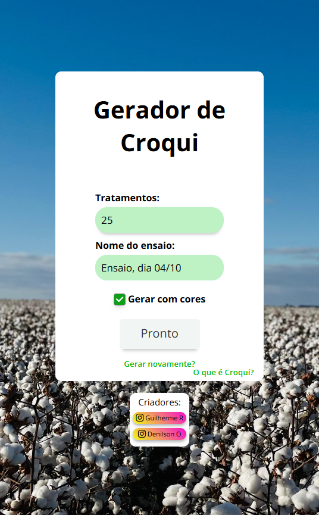
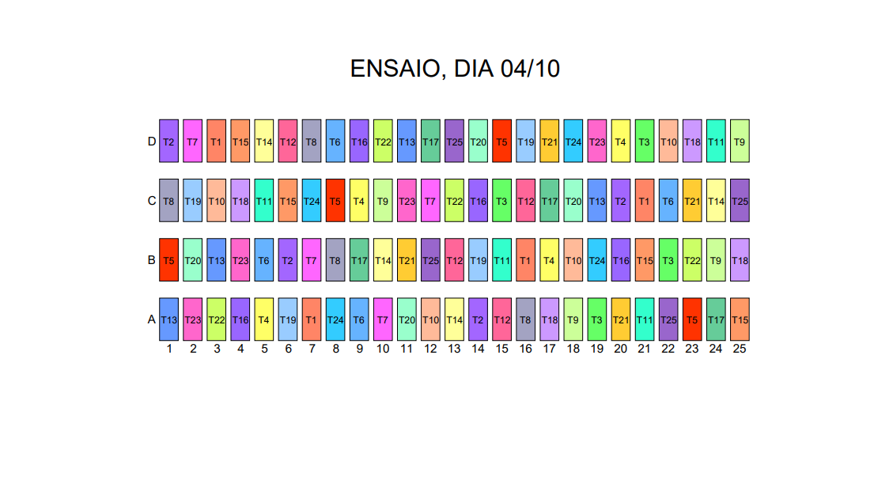

<div align="center">

<h1 align="center">Gerador de Croqui</h1>

<p align="center">
  <strong>Gerador de Croqui é uma ferramenta web open-source para gerar croquis de experimentos agrícolas em PDF, com distribuição aleatória de tratamentos, personalização de cores e processamento via Web Workers.</strong>
</p>

<p align="center">
  <a href="#"></a>
  <a href="#"></a>
  <a href="#"></a>
</p>

<br />

<p align="center">
  
</p>

</div>

---

> **Este é um dos meus primeiros projetos** — desenvolvido **100% sem o uso de IA**, do zero, com HTML, CSS e JavaScript puro. Está no ar em produção em [geradordecroqui.netlify.app](https://geradordecroqui.netlify.app/).

---

## Sobre o projeto

O **Gerador de Croqui** é uma aplicação web para **planejamento visual de experimentos agrícolas**, permitindo gerar e exportar croquis em PDF de forma rápida e totalmente aleatória.

> Desenvolvido para pesquisadores e técnicos agrícolas que precisam organizar a disposição de tratamentos em campo com praticidade e sem repetição de valores em linhas, colunas ou diagonais.

### O que é um Croqui?

Croqui é um esboço simplificado usado para representar a distribuição de tratamentos em um experimento de campo. Ele permite:

- Organizar os tratamentos de forma visualmente clara
- Garantir uma distribuição equilibrada e evitar viés nos resultados
- Facilitar a comunicação entre pesquisadores, técnicos e demais envolvidos

### Funcionalidades

- Geração de croquis em **PDF** com layout dinâmico baseado no número de tratamentos
- **Distribuição totalmente aleatória** — nenhum tratamento se repete na mesma linha, coluna ou diagonal
- **Opção de cores** por tratamento, com paleta de até 40 cores distintas
- **Web Workers** para processamento em segundo plano, sem travar a interface
- Validação de entrada (aceita de 5 a 40 tratamentos)
- Campo de nome do ensaio inserido diretamente no PDF gerado
- Interface responsiva e moderna
- Botão "Gerar novamente?" para novo ensaio sem recarregar a página

> **Algoritmo de aleatoriedade:** cada geração garante que nenhum tratamento se repete em qualquer linha, coluna ou diagonal do croqui — assegurando a integridade estatística do experimento.

---

## Tecnologias Usadas

| Tecnologia | Descrição |
|------------|-----------|
|  | Estrutura da interface |
|  | Estilização e responsividade |
|  | Lógica da aplicação (ES6+) |
|  | Processamento paralelo sem travar a UI |
|  | Geração e exportação de PDFs |

---

## Como usar

1. Acesse o site em [geradordecroqui.netlify.app](https://geradordecroqui.netlify.app/)
2. Preencha os campos:
   - **Quantidade de tratamentos** (entre 5 e 40)
   - **Nome do ensaio** (será exibido como título no PDF)
   - Marque **"Gerar com cores"** se quiser células coloridas
3. Clique em **Gerar PDF** — o arquivo será baixado automaticamente
4. Para um novo croqui, clique em **Gerar novamente?**

---

## Como rodar localmente

Não há dependências de instalação. Basta clonar e abrir o arquivo no navegador:

```bash
git clone https://github.com/GuilhermeRBr/Gerador-de-croqui-site.git
cd Gerador-de-croqui-site
# Abra o index.html no seu navegador
```

> Como o projeto usa módulos ES6 (`type="module"`), recomenda-se usar uma extensão como **Live Server** (VS Code) ou qualquer servidor HTTP local para evitar erros de CORS.

---

## Estrutura de Pastas

```
Gerador-de-croqui-site/
├── assets/
│   ├── icons/
│   │   └── favicon.ico
│   └── img/
│       └── fundo.jpg
├── css/
│   ├── animations.css
│   ├── components.css
│   ├── fonts.css
│   ├── layout.css
│   ├── reset.css
│   ├── responsive.css
│   └── style.css
├── js/
│   ├── dom.js
│   ├── main.js
│   ├── utils.js
│   └── worker.js
├── index.html
└── README.md
```

---

## Colaboradores

<table align="center">
  <tr>
    <td align="center">
      <br />
      <sub><b>Guilherme Rebouças</b></sub><br />
      <a href="https://www.instagram.com/guilhermer.dev/" target="_blank">@guilhermer.dev</a><br />
      <span>Desenvolvedor</span>
    </td>
    <td align="center">
      <br />
      <sub><b>Denilson Oliveira</b></sub><br />
      <a href="https://www.instagram.com/denilson_oliveira_br/" target="_blank">@denilson_oliveira_br</a><br />
      <span>Idealizador</span>
    </td>
  </tr>
</table>

---

## Licença

Este projeto está licenciado sob a [MIT License](LICENSE).

---

## Preview

<div align="center">
  
  &nbsp;
  
</div>

<br />

<div align="center">
  
</div>
